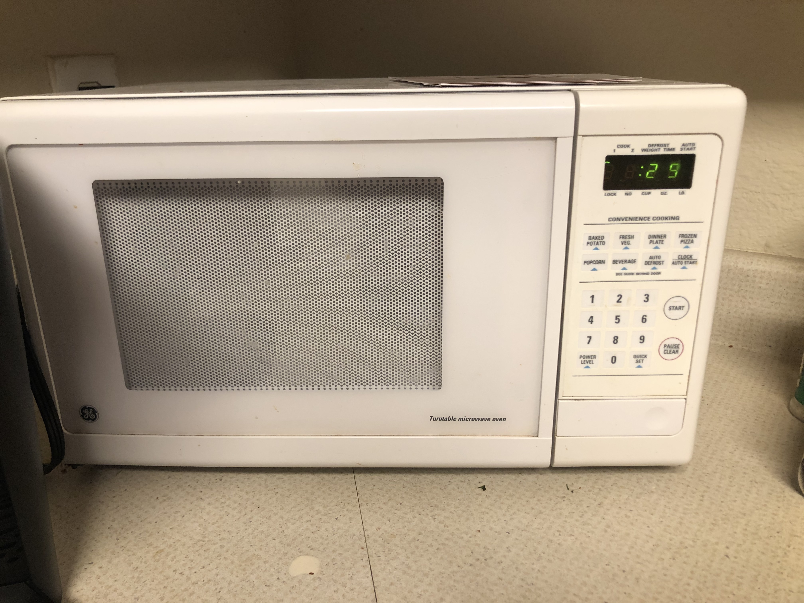

 
<h2> Original Microwave </h2>

<h3> Original Microwave Working </h3>

<h3> Problems with Original Design </h3>
  
 * Display is too small
 * Unclear and confusing labels above display
 * Unecessary and confusing buttons
 * Inconsistent shapes in buttons
  
<h2> Improvements needed </h2>

<h3> Most Common Uses </h3>
  * defrosting 
  * reheating
  * making tea
  * 
<h3> Common Mistakes </h3>
  * too complicated
  * too many features that will not be used
<h3> Common Sequence of Action </h3>
<h3> Open -> Set Time -> Start -> Receive warning time is up -> Be able to stop
<h2> New Design </h2>

<h3> Changes </h3>
* Bigger display
* Removal of unecessary buttons
* Made all buttons same shape except for on/off button
