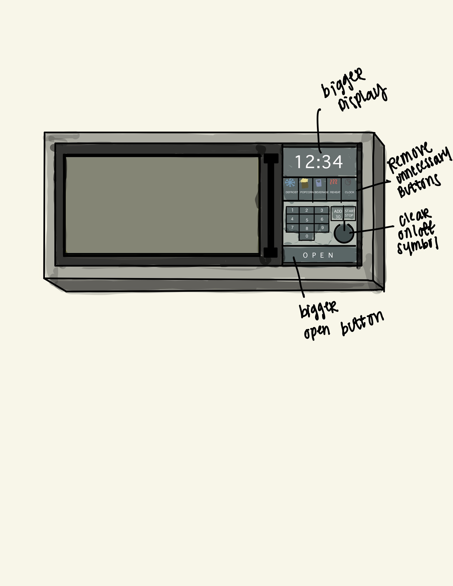

 
<h2> Original Microwave </h2>

<h3> Problems with Original Design </h3>
  
  * Display is too small
  * Unecessary and confusing buttons
  * no open button
  
<h2> New Design </h2>

<h3> Changes </h3>
